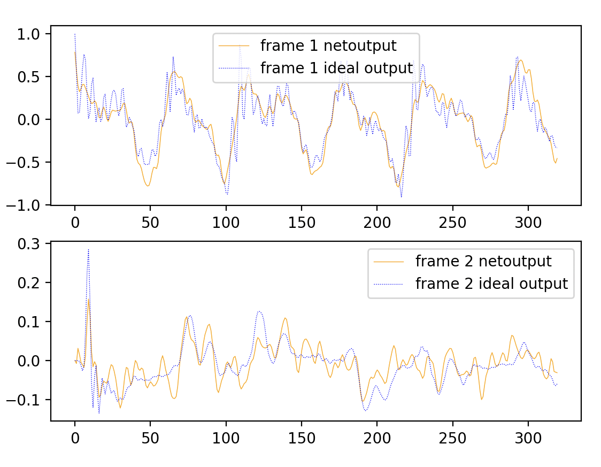
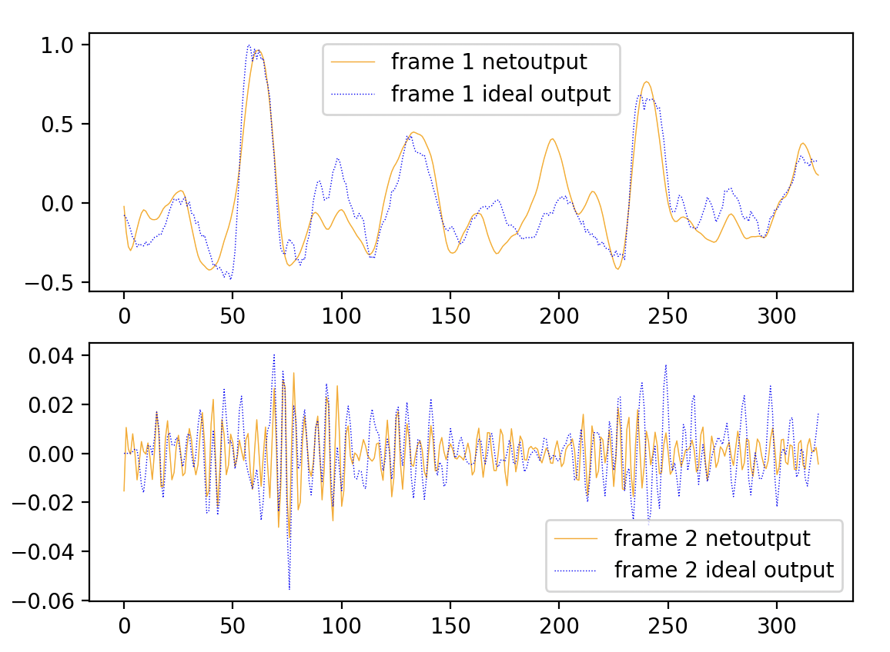

# Audio Denoising: A Heterodyned Approach


<div style="display:flex;">
    
    
</div>

In this study, we present a two-stage audio-denoising system. In addition, we also present a novel method of audio-denoising that overcomes a fundamental problem with neural network training where MSE is involved. Our denoising pipeline involves two stages. The first stage is a variant of the conventional spectral-subtraction ap- proach, borrowed from Sharma et al [1]. This approach involves estimating the noise spectrum and subtracting it from the input-spectrum to obtain the spectrum of the estimated clean-speech. The output of this method suppresses noise but in addition, introduces some artifacts. The second stage of the pipeline uses a data-driven neural network approach. This stage takes in both the noisy-frame as well as the spectral- subtracted frame to produce the clean-speech estimate. We introduce a novel method of denoising high-frequency components that reduces the infamous long-tail problem of neural networks which in turn also reducing training time.

## Data-Generation
To create the dataset for this task, 
1. Download TIMIT database
2. In the file DataGeneration/TIMIT_DataGen and DataGeneration/T26_Saving_RawFrame_SSFrame_CleanSpeechFrame, change the indicated paths and run file DataGeneration/TIMIT_DataGen. This file will go through the TIMIT data base, create Noisy-frames at different SNRs and save the noisy-frame, spectral-subtracted frame and clean-speech frame, to the path you specified, as matfiles.

## Training
Once the dataset has been created, train the Frame-To-Frame Model in the following manner
```
cd FrameToFrame
python FrameToFrameTraining.py
```
Similarly, train the Frame-To-DFT model in the following manner
```
cd FrameToDFT
python FrameToFrameTraining.py
```

## Evaluation

